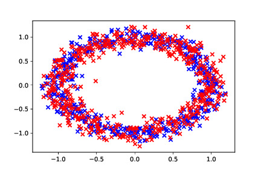
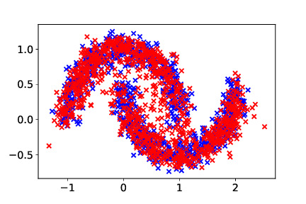

Implementation of probabilistic models in PyTorch

## Restricted Boltzmann Machine (RBM) with Gibbs sampling

Samples generated with RBM for circle data \
https://github.com/phanav/probabilistic-model/blob/main/src/lab2_rbm_v2.ipynb

## Real NVP Flow (Non-Volume-Preserving Normalizing Flow)

Samples generated with Real NVP Flow for half moon data \
https://github.com/phanav/probabilistic-model/blob/main/src/lab3_nvp_v2.ipynb
